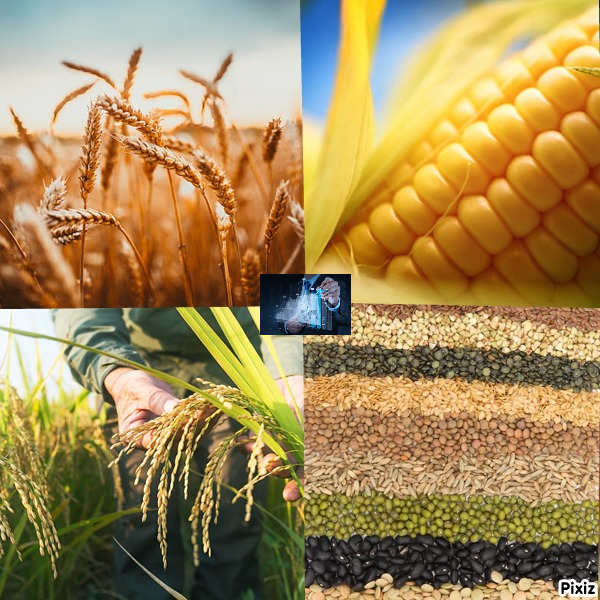

# Cereal  Prices Analysis and Prediction

**What will you obtain from this project ?**
* Data preprocessing (Numpy,Pandas)
* Data visualization(Seaborn,Matplotlib)
* Data prediction(sklearn.metrics,model_selection)
* Feature Engineering

**Introduction**
* The Cereals are one of the most important resources for all living things
* Grain and cereal products are significant foods for health because they contain vitamins, minerals, carbohydrates (starch, fiber) and other nutrients, and their carbohydrate content is high.
* Corn and Rice can be grown in warm places.In addition,Wheat can be grown in cool places.

### Table of Contents
* [General Info](#general-info)
* [Technologies](#technologies)

### General Info
This project has made cereal prices analysis,visualization and forecasting.Cereal prices's changing has supported with graphics.

### Technologies
* PyCharm: 2021.3
* pandas==1.4.1
* numpy==1.22.3
* matplotlib==1.16

